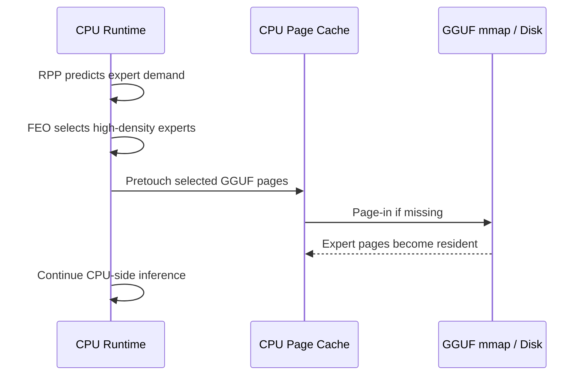
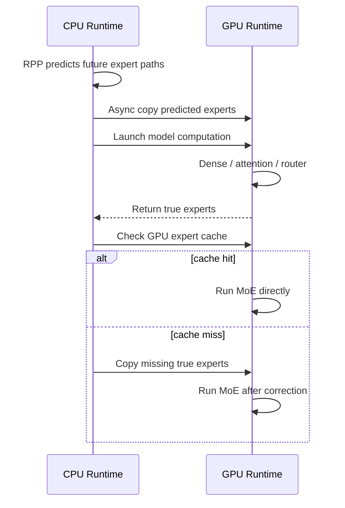
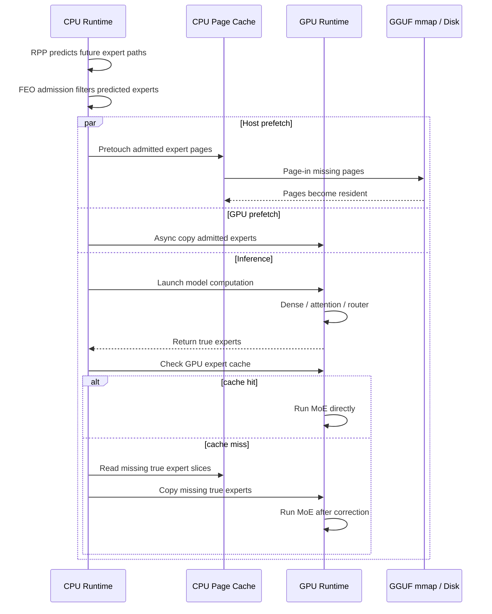

## Method

這個 branch 的目標是把原本 RPP runtime prototype 往 CPU-GPU mixed prefetch 方向延伸。原先的 prototype 主要處理 `CPU DRAM -> GPU VRAM`，也就是利用 RPP 預測未來會被使用的 experts，提前把 selected expert weights 搬進 GPU expert cache。這次整合後，除了 GPU expert cache，也加入同學 FEO-style CPU page-cache prefetch 的概念，使系統同時考慮：

```text
disk / GGUF mmap -> CPU DRAM page cache -> GPU VRAM expert cache
```

不過本 branch 的重點不是重新實作完整 CPU FEO 架構，而是把 FEO 的核心想法接到 GPU runtime。RPP 不直接取代原模型 router，而是提供 memory hint。模型真正使用哪些 experts 仍由 true router 決定；若 RPP 預測錯誤，runtime 會用 true router 結果進行 correction，因此不應改變模型輸出。

同學原本 CPU-only FEO 的主要目標，是在模型權重透過 GGUF mmap 由 OS page cache 管理的情況下，提前把 high-frequency experts 的 pages 從 disk 拉進 CPU DRAM。這個方法直接處理的是 `disk -> CPU DRAM` 的 blocking page fault 問題，適合 CPU-only inference 或 CPU memory pressure 明顯的場景。



我的原本 GPU runtime 則處理另一個問題：即使 expert pages 已經在 CPU DRAM 中，若 experts 沒有在 GPU VRAM，MoE layer 真正需要它們時仍然會卡在 `CPU DRAM -> GPU VRAM` 的同步搬移。因此 GPU 部分的設計重點是建立 GPU expert cache。由於完整 MoE weights 無法全部常駐於 6GB VRAM，runtime 會把每個 `(layer, expert)` 視為可動態搬移的 cache entry。當 RPP 預測某些 experts 即將被使用時，CPU runtime 會在背景把這些 experts 複製到 GPU cache；當模型真正執行到 MoE layer 時，再用 true router 檢查 cache：



CPU-only FEO 與 GPU expert cache 的差別在於：前者減少 page fault，後者減少 GPU demand-time copy。這兩者不是互相取代，而是處理 memory hierarchy 中不同層的 stall。因此 mixed path 的想法是：RPP prediction 先經過 FEO-style admission，保留 batch 中較高密度、較可能被多 tokens 共用的 experts；被保留的 experts 一方面用來 pretouch GGUF pages，另一方面用來排入 GPU copy queue。最後模型仍以 true router 結果為準，cache miss 時才同步 correction。



混合後的重點不是「CPU 多做一層 prefetch 就一定比較快」，而是要讓兩層 prefetch 都不要製造過多額外工作。若 CPU pretouch 太積極，可能造成 disk I/O 增加或 page-cache churn；若 GPU prefetch 太積極，可能造成 copy queue 排隊、VRAM cache eviction，甚至把真正快用到的 experts 擠出去。因此，本 branch 加入幾個控制機制：

- `prefetch depth`：控制要提前幾層載入。
- `top-k`：控制每個 token / layer 只預取 RPP 最有信心的前幾個 experts。
- deadline-aware copy queue：讓較快會被使用的 experts 優先搬入 GPU。
- multiple copy workers：降低單一 copy queue 排隊時間。
- FEO-style admission：把同一個 ubatch 的 predicted routes 聚合，只預取 batch 中密度較高、較可能被多 tokens 共用的 experts。
- FEO-aware reclaim：GPU cache 滿時，避免太早淘汰未來 window 中可能再次被用到的 experts。

總結來說，同學的 CPU-only FEO 比較像是在 OS page cache 前面加上 expert-aware hints；我的 GPU runtime 則是在有限 VRAM 中加入 expert-aware GPU cache。這個 branch 的 mixed design 是把兩者接起來，但評估標準必須是 end-to-end latency，而不是單純看 page fault 或 ready hit 單一指標。

## Experiment

實驗的核心問題是：

```text
RPP prediction 是否能同時幫助 CPU page cache 與 GPU expert cache，
讓 expert weight loading 從 critical path 中移出，
並在有限 VRAM / DRAM 的環境下帶來實際推論加速？
```

因此實驗不應只比較「有沒有 RPP」，而要分成幾個層次：

| config | 目的 |
|---|---|
| original llama.cpp / ngl baseline | 觀察原始 llama.cpp offload 行為 |
| `rpp_depth_0_c512` | 有 GPU expert cache 與 true-router correction，但沒有 predictive prefetch |
| `rpp_deadline_d1_k2_w2_c512` | 加入 GPU predictive prefetch |
| `rpp_mixed_host_d1_k2_w2_c512` | 加入 CPU page-cache pretouch 的 mixed path |
| `rpp_feo_mixed_d1_k2_w2_c512` | 加入 FEO admission 與 FEO-aware reclaim |

目前已完成一組 3 prompts、每個 request 生成 8 tokens 的 smoke test。這組測試的目的只是確認 runtime 路徑能跑，不能當作最終效能結論：

| config | generated | decode t/s | TPOT ms | wall ms | ready hit | correction p95 ms |
|---|---:|---:|---:|---:|---:|---:|
| `rpp_depth_0_c512` | 8.0 | 0.060 | 16549.5 | 351249.1 | 26.4% | 425.0 |
| `rpp_deadline_d1_k2_w2_c512` | 8.0 | 0.063 | 15985.2 | 340018.0 | 39.0% | 344.9 |
| `rpp_mixed_host_d1_k2_w2_c512` | 8.0 | 0.054 | 18461.8 | 364743.6 | 39.5% | 463.4 |

初步結果顯示，GPU-only prefetch 讓 ready hit 從 26.4% 提升到 39.0%，correction p95 從 425.0 ms 降到 344.9 ms，TPOT 與 wall time 也略有下降。這代表 GPU expert cache + predictive prefetch 的方向是合理的。

但 naive mixed host pretouch 的結果反而變慢：ready hit 雖然維持在 39.5%，但 TPOT 與 correction p95 都變差。這表示把 CPU page-cache prefetch 加進來不一定自然加速；如果 prefetch 過度積極，可能會增加 disk I/O、page-cache churn 或 CPU scheduling overhead，反而干擾原本的 GPU prefetch。

因此後續實驗應該把重點放在 FEO admission 是否能解決這個問題。也就是說，mixed path 的價值不在於「多加一層 CPU prefetch」，而在於透過 batch-level density 過濾出真正值得提前載入的 experts，減少低價值 prefetch。

接下來需要補的實驗：

- 使用 target repo 自己編出的 CUDA `llama-server` 跑 `rpp_feo_mixed_d1_k2_w2_c512`，不能借用舊 runtime binary。
- 在 14GB memory limit 下重跑 mixed / FEO mixed，讓 CPU page-cache pressure 更接近本機實際情境。
- 用 5 到 10 個 prompts、每個 request 生成 32 到 64 tokens，測試較長 decode 下的穩定性。
- 補上 original llama.cpp / ngl baseline，確認目前瓶頸到底來自原始 offload、GPU copy、disk I/O，還是 RPP sidecar overhead。

評估時不能只看 ready hit。真正能說明加速與否的指標至少包含：

```text
decode tokens/s
TPOT
wall time
ready hit
correction p95
host pretouch bytes/pages
major/minor page faults
GPU copy queue wait
generated token count
```

如果 ready hit 上升但 wall time 變差，代表 prefetch 做了更多工作，但沒有成功被 compute overlap 掉。如果 correction p95 下降但 wall time 沒下降，則可能是 sidecar、server startup、prompt processing 或 disk I/O 吃掉收益。因此最後必須用 end-to-end latency，而不是單一 cache 指標，來判斷這個方法是否真的有效。

## Future work

第一個後續工作是完成 FEO mixed 的實測。現在程式路徑已經有 FEO admission 與 FEO-aware GPU reclaim，但 CUDA build 尚未完整完成，因此還不能把 FEO mixed 的結果寫成正式結論。完成 build 後，應先跑小型 smoke test，再跑 memory-limit 與 longer decode。

第二個後續工作是更精準地量測 overlap。現在我們知道部分 prefetch 沒有在使用前完成，但還需要記錄更完整的時間點：

```text
T0 = enqueue prefetch
T1 = copy / page-in starts
T2 = copy / page-in completes
T3 = expert is actually needed
```

有了這些時間點，才能判斷問題到底是 GPU compute window 太短、GPU copy queue 排隊、disk I/O 太慢、RPP 預測錯誤，還是 cache eviction policy 不適合。

第三個後續工作是 route-similarity token regrouping / microbatch scheduling。目前 branch 主要做 prefetch，沒有真正改變 llama.cpp 的 ubatch token order。若未來能把 predicted route 相似的 decode tokens 放進同一個 microbatch，就有機會減少每個 microbatch 啟動的 distinct experts，進一步降低 expert loading 和提升 GPU utilization。不過這會牽涉 slot、KV cache、logits mapping 與 autoregressive order，因此應獨立成下一階段實驗。
