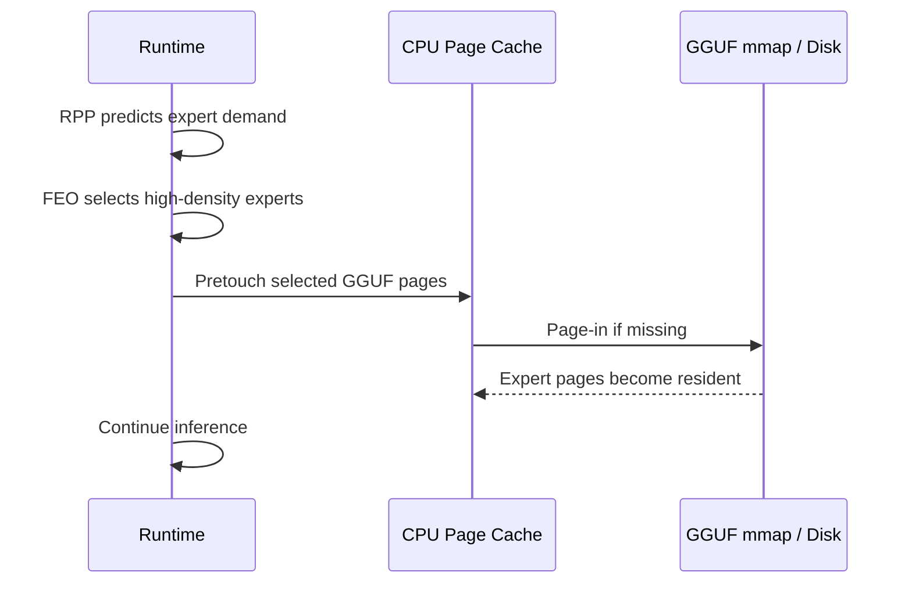
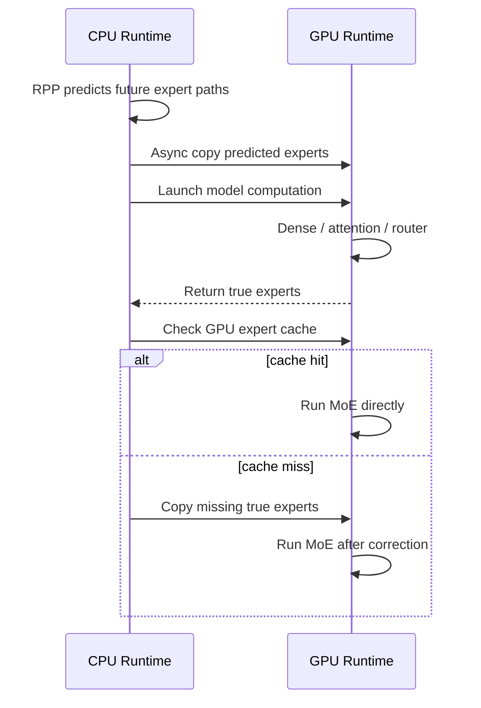
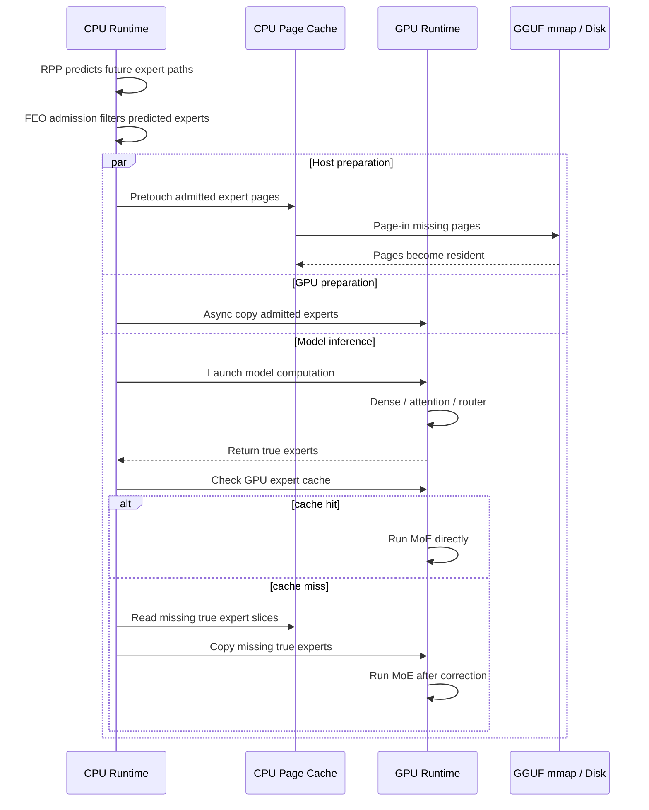

## Method

本專題原本的 CPU-side prefetch 方法主要處理 `disk -> CPU DRAM` 的問題。由於 GGUF 模型透過 mmap 交給 OS page cache 管理，當模型真正需要某些 expert weights 但對應 pages 不在 page cache 中時，推論會被 major page fault 阻塞。RPP 與 FEO 的目的，是在模型執行到未來 MoE layers 之前，先預測哪些 experts 可能會被使用，並將較高頻率、較值得保留的 expert pages 提前放入 CPU page cache。

這個 branch 嘗試處理下一層 memory hierarchy：`CPU DRAM -> GPU VRAM`。即使 expert pages 已經在 CPU DRAM 中，如果 MoE expert weights 還沒有被搬進 GPU VRAM，當 GPU 真正執行到該 MoE layer 時，仍然需要等待同步的 host-to-device copy。因此本 branch 在既有 CPU-side prefetch 的基礎上，加入 GPU expert cache，讓 RPP prediction 不只用於 CPU page-cache hint，也用於提前把 predicted experts 搬入 GPU。

整體資料路徑如下：

```text
disk / GGUF mmap -> CPU DRAM page cache -> GPU VRAM expert cache -> GPU MoE compute
```

RPP 在這裡不取代原模型 router，而是提供 memory hint。模型真正使用哪些 experts 仍由 true router 決定；若 prediction miss，runtime 會根據 true router 結果同步補搬 missing experts，再執行 MoE。因此這個方法的目標是降低 expert loading 的等待時間，而不是改變模型 routing 或輸出。

CPU-side prefetch 的簡化流程如下：



GPU-side prefetch 的簡化流程如下：



將兩者合併後，runtime 會先用 RPP 產生未來 routing path，再用 FEO-style admission 過濾出 batch 中較高密度、較可能被多個 tokens 共用的 experts。這些 admitted experts 會同時進入兩條 preparation path：一條負責 host page-cache pretouch，另一條負責 GPU expert-cache prefetch。模型主流程仍正常執行 dense、attention 與 true router；只有在 MoE layer 真的需要 experts 時，才檢查 GPU cache 並進行 correction。



這個設計的困難在於 prefetch 不一定帶來加速。若 prefetch 太晚，資料在 MoE layer 需要時仍未準備完成，GPU 仍會等待；若 prefetch 太多，則會增加 disk I/O、page-cache churn、GPU copy queue 排隊，以及 GPU cache eviction。因此本 branch 實際嘗試了幾個控制方式：

- `prefetch depth`：控制提前幾層開始準備 experts。
- `top-k`：控制每個 token / layer 只預取 RPP 最有信心的前幾個 experts。
- deadline-aware copy queue：讓較快會被使用的 experts 優先搬入 GPU。
- multiple copy workers：降低單一 copy queue 的排隊時間。
- FEO-style admission：把同一個 ubatch 的 predicted routes 聚合，只預取 density 較高的 experts。
- FEO-aware reclaim：GPU cache 滿時，優先保留未來 window 中可能再次使用的 experts。


## Experiment

目前實驗的目標，是檢查 RPP prediction 能否同時協助 CPU page cache 與 GPU expert cache，讓 expert weight loading 盡量從 critical path 中移出。實驗環境目前以本機為主，設定如下：

```text
GPU: NVIDIA GeForce RTX 3060 Laptop GPU, 6GB VRAM
CPU memory: 16GB class local machine
model: Gemma4 26B GGUF
runtime: modified llama.cpp
RPP: online sidecar with checkpoint_best.pt
GPU expert cache: 512 MiB in current test
server parallel: 3
client concurrency: 3
prompts: 3
generated tokens per request: 8
```

比較組如下：

| config | 目的 |
|---|---|
| original llama.cpp / ngl baseline | 觀察原始 llama.cpp offload 行為 |
| `rpp_depth_0_c512` | 有 GPU expert cache 與 true-router correction，但沒有 predictive prefetch |
| `rpp_deadline_d1_k2_w2_c512` | 加入 GPU predictive prefetch，使用 deadline queue 與 2 copy workers |
| `rpp_mixed_host_d1_k2_w2_c512` | 在 GPU prefetch 外，再加入 CPU page-cache pretouch |
| `rpp_feo_mixed_d1_k2_w2_c512` | 加入 FEO admission 與 FEO-aware GPU reclaim |

目前已完成的測試結果如下：

| config | generated | decode t/s | TPOT ms | wall ms | ready hit | correction p95 ms |
|---|---:|---:|---:|---:|---:|---:|
| `rpp_depth_0_c512` | 8.0 | 0.060 | 16549.5 | 351249.1 | 26.4% | 425.0 |
| `rpp_deadline_d1_k2_w2_c512` | 8.0 | 0.063 | 15985.2 | 340018.0 | 39.0% | 344.9 |
| `rpp_mixed_host_d1_k2_w2_c512` | 8.0 | 0.054 | 18461.8 | 364743.6 | 39.5% | 463.4 |

從目前結果可以看到，加入 GPU predictive prefetch 後，ready hit 從 26.4% 提升到 39.0%，correction p95 從 425.0 ms 降到 344.9 ms，TPOT 與 wall time 也略有下降。這表示 GPU expert cache 加上 RPP prefetch 的方向是有機會的。

但直接加入 CPU page-cache pretouch 後，結果反而變慢。`rpp_mixed_host_d1_k2_w2_c512` 的 ready hit 與 GPU-only prefetch 接近，但 TPOT 與 correction p95 都變差。這代表 naive host pretouch 可能製造額外 disk I/O、page-cache churn 或 CPU scheduling overhead，進而抵消 GPU prefetch 的收益。

因此目前觀察到的重點是：mixed prefetch 不應該只是把所有 predicted pages 都提前讀進 CPU DRAM，而是需要 admission policy 控制 prefetch 範圍。這也是加入 FEO-style admission 的原因：利用 batch-level density 過濾低價值 prediction，讓 CPU page-cache prefetch 和 GPU expert-cache prefetch 都集中在較可能被共用的 experts 上。

除了上述數據，本 branch 也嘗試過以下方向：

- 測試 `depth=1/2`，確認 prefetch window 太深時可能增加 queue pressure。
- 測試 `top-k=2/4/8`，觀察 top-k 太大時會增加無效 copy。
- 從 FIFO copy queue 改成 deadline-aware queue，讓接近使用時間的 experts 優先。
- 增加 GPU copy workers，嘗試降低單一 copy worker 的排隊時間。
- 加入 host pretouch，確認 CPU page-cache prefetch 是否能和 GPU prefetch 互補。
- 加入 FEO admission / reclaim，嘗試避免 naive mixed prefetch 製造過多額外 I/O。


現在的結果比較適合說明目前嘗試到的現象與問題，而不是作為最終效能結論。

## Future work

第一個可以進行方向，是完成 FEO mixed 的正式實測。現在程式路徑已經有 FEO admission 與 FEO-aware GPU reclaim。

第二個，是加入 memory pressure。CPU page-cache prefetch 在沒有明顯 memory pressure 時，可能只是增加額外讀取；在 DRAM 接近滿載時，它才比較可能展現「提前把正確 pages 留在 cache」的價值。因此後續需要在 14GB memory limit 或類似條件下重跑 mixed / FEO mixed。

第三個，是更精準地量測 overlap。目前我們知道部分 prefetch 沒有在使用前完成，但還需要記錄更完整的時間點：

```text
T0 = enqueue prefetch
T1 = copy / page-in starts
T2 = copy / page-in completes
T3 = expert is actually needed
```

有了這些時間點，才能判斷問題到底是 GPU compute window 太短、GPU copy queue 排隊、disk I/O 太慢、RPP 預測錯誤，還是 cache eviction policy 不適合。

第四個，是 route-similarity token regrouping / microbatch scheduling。目前 branch 主要做 prefetch，沒有真正改變 llama.cpp 的 ubatch token order。若未來能把 predicted route 相似的 decode tokens 放進同一個 microbatch，就有機會減少每個 microbatch 啟動的 distinct experts，進一步降低 expert loading 和提升 GPU utilization。不過這會牽涉 slot、KV cache、logits mapping 與 autoregressive order，因此應獨立成下一階段實驗。
