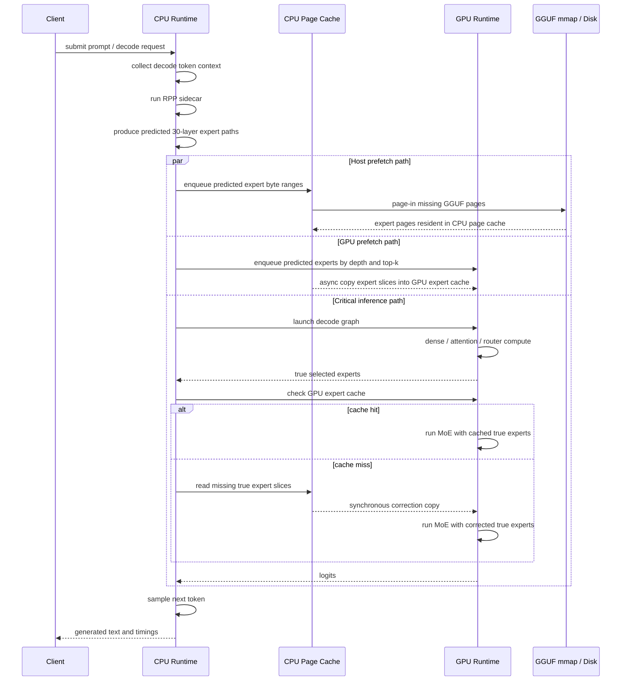

# CPU-GPU Mixed RPP Prefetch

這個 branch 的目標是把兩條原本分開的路線合在一起：

1. 同學原本的 CPU/page-cache optimization：用 RPP 預測 expert route，提前把 GGUF expert byte ranges 從 disk 拉進 CPU DRAM page cache。
2. 目前 runtime prototype：用 RPP 預測 expert route，提前把 selected expert slices 從 CPU memory 搬進 GPU expert cache，並用 true router 做 correction，避免改變模型輸出。

合併後的研究問題是：

```text
RPP 是否可以同時降低 disk -> CPU DRAM 與 CPU DRAM -> GPU VRAM 的 critical-path stall？
```

## Architecture



## What Changed

The `llama.cpp` directory in this branch is replaced with the RPP runtime base that already supports:

- `--rpp-mode off|replay|online`
- online RPP sidecar calls
- decode-only RPP prediction with `--no-rpp-prefill --rpp-decode`
- host page-cache pretouch with `--rpp-host-prefetch pretouch`
- GPU expert cache with `--rpp-gpu-correction on`
- GPU MoE expert remapping with `--rpp-gpu-compute on`
- deadline-aware GPU copy queue with `--rpp-gpu-queue-policy deadline`
- multiple GPU copy workers with `--rpp-gpu-copy-workers N`
- configurable prefetch depth and top-k

The existing CPU/page-cache experiment scripts under `experiments/gemma4_IO_behaviors` are kept. This folder adds a small benchmark harness for comparing GPU-only prefetch and CPU+GPU mixed prefetch.

## Build

CPU-only structural build:

```bash
cd /home/jacky20040024/projects/跑gemma/for_repo_branch/MoE-inference-Optimization

cmake -S llama.cpp -B llama.cpp/build-rpp-cpu \
  -DCMAKE_BUILD_TYPE=Release \
  -DLLAMA_BUILD_UI=OFF

cmake --build llama.cpp/build-rpp-cpu -j"$(nproc)" \
  --target llama-server test-rpp-args test-rpp-runtime test-rpp-prefetch test-rpp-replay
```

CUDA build, if local CUDA toolkit and driver match:

```bash
cd /home/jacky20040024/projects/跑gemma/for_repo_branch/MoE-inference-Optimization

cmake -S llama.cpp -B llama.cpp/build-rpp-cuda118 \
  -DCMAKE_BUILD_TYPE=Release \
  -DGGML_CUDA=ON \
  -DLLAMA_BUILD_UI=OFF

cmake --build llama.cpp/build-rpp-cuda118 -j"$(nproc)" \
  --target llama-server test-rpp-args test-rpp-runtime test-rpp-prefetch test-rpp-replay
```

If CMake uses the miniforge `nvcc` and fails with:

```text
cannot find -lcudadevrt
cannot find -lcudart_static
```

then the CUDA toolkit visible to CMake is incomplete. This is an environment issue, not an RPP source issue. Use a complete CUDA toolkit, or point CMake to the working CUDA installation, for example:

```bash
export CUDAToolkit_ROOT=/usr/local/cuda-11.8
export CMAKE_CUDA_COMPILER=/usr/local/cuda-11.8/bin/nvcc
```

Adjust the path to the actual toolkit installed on the machine.

## Environment

The benchmark scripts use these defaults on this workstation:

```text
workspace: /home/jacky20040024/projects/跑gemma
model:     /home/jacky20040024/projects/跑gemma/models/workstation_gemma4-26B.gguf
page map:  /home/jacky20040024/projects/跑gemma/workstation_cc/experiment_templates/exp_expertflow_predictor/outputs/prompt10000_all_loss/phase2_gguf_pages/expert_page_map.csv
server:    llama.cpp/build-rpp-cuda118/bin/llama-server
```

Override them when needed:

```bash
export MIXED_PREFETCH_WORKSPACE=/home/jacky20040024/projects/跑gemma
export MIXED_PREFETCH_MODEL=/path/to/gemma4-26B.gguf
export MIXED_PREFETCH_PAGE_MAP=/path/to/expert_page_map.csv
export MIXED_PREFETCH_SERVER=/path/to/llama-server
```

For non-FEO smoke tests, while this branch's CUDA build is being fixed, you can
temporarily point the harness to the already-working runtime binary:

```bash
export MIXED_PREFETCH_SERVER=/home/jacky20040024/projects/跑gemma/rpp_runtime_implementation/llama.cpp/build-rpp-cuda118/bin/llama-server
```

Do not use that older binary for FEO configs. FEO configs require the
`llama-server` built from this branch, because they use
`--rpp-prefetch-admission feo` and `--rpp-gpu-reclaim-policy feo`.

## Smoke Test

This compares:

- `rpp_depth_0_c512`: RPP online + true-router correction + GPU cache, but no predictive prefetch.
- `rpp_deadline_d1_k2_w2_c512`: GPU predictive prefetch only.
- `rpp_mixed_host_d1_k2_w2_c512`: CPU page-cache pretouch + GPU predictive prefetch.
- `rpp_feo_mixed_d1_k2_w2_c512`: CPU page-cache pretouch + GPU predictive prefetch with FEO-style ubatch density admission and FEO-aware GPU cache reclaim.

```bash
cd /home/jacky20040024/projects/跑gemma/for_repo_branch/MoE-inference-Optimization

python experiments/cpu_gpu_mixed_prefetch/scripts/run_prefetch_benchmark.py \
  --out-dir experiments/cpu_gpu_mixed_prefetch/outputs/smoke_3p8t \
  --rounds 1 \
  --repeats 1 \
  --n-predict 8 \
  --configs rpp_depth_0_c512 rpp_deadline_d1_k2_w2_c512 rpp_mixed_host_d1_k2_w2_c512 \
  --prompt-file experiments/cpu_gpu_mixed_prefetch/prompts/long_decode_3.jsonl \
  --server-parallel 3 \
  --client-concurrency 3 \
  --request-timeout 1200 \
  --startup-timeout 900 \
  --max-hours 1.5

python experiments/cpu_gpu_mixed_prefetch/scripts/analyze_prefetch_benchmark.py \
  experiments/cpu_gpu_mixed_prefetch/outputs/smoke_3p8t
```

## FEO Smoke Test

Use this to compare naive token-level top-k prefetch against FEO-style filtering:

```bash
cd /home/jacky20040024/projects/跑gemma/for_repo_branch/MoE-inference-Optimization

export MIXED_PREFETCH_SERVER=/home/jacky20040024/projects/跑gemma/for_repo_branch/MoE-inference-Optimization/llama.cpp/build-rpp-cuda118/bin/llama-server

python experiments/cpu_gpu_mixed_prefetch/scripts/run_prefetch_benchmark.py \
  --out-dir experiments/cpu_gpu_mixed_prefetch/outputs/feo_smoke_3p8t \
  --rounds 1 \
  --repeats 1 \
  --n-predict 8 \
  --configs rpp_depth_0_c512 rpp_mixed_host_d1_k2_w2_c512 rpp_feo_mixed_d1_k2_w2_c512 \
  --prompt-file experiments/cpu_gpu_mixed_prefetch/prompts/long_decode_3.jsonl \
  --server-parallel 3 \
  --client-concurrency 3 \
  --request-timeout 1200 \
  --startup-timeout 900 \
  --max-hours 1.5

python experiments/cpu_gpu_mixed_prefetch/scripts/analyze_prefetch_benchmark.py \
  experiments/cpu_gpu_mixed_prefetch/outputs/feo_smoke_3p8t
```

The expected improvement is not necessarily a higher raw prefetch count. FEO should reduce low-density prefetch work while preserving useful ready hits, so check host prefetch bytes/pages, correction p95, TPOT, and wall time together.

## Optional 14G Memory Limit

To make the local run closer to the classmate's memory-pressure setting, wrap the same benchmark in a cgroup memory limit:

```bash
cd /home/jacky20040024/projects/跑gemma/for_repo_branch/MoE-inference-Optimization

experiments/cpu_gpu_mixed_prefetch/scripts/run_under_memory_limit.sh 14G -- \
python experiments/cpu_gpu_mixed_prefetch/scripts/run_prefetch_benchmark.py \
  --out-dir experiments/cpu_gpu_mixed_prefetch/outputs/feo_smoke_3p8t_mem14g \
  --rounds 1 \
  --repeats 1 \
  --n-predict 8 \
  --configs rpp_depth_0_c512 rpp_mixed_host_d1_k2_w2_c512 rpp_feo_mixed_d1_k2_w2_c512 \
  --prompt-file experiments/cpu_gpu_mixed_prefetch/prompts/long_decode_3.jsonl \
  --server-parallel 3 \
  --client-concurrency 3 \
  --request-timeout 1200 \
  --startup-timeout 900 \
  --max-hours 1.5
```

This wrapper uses `systemd-run --user`. If user systemd is not available in WSL, use the normal command or run the benchmark inside a Docker/cgroup environment instead.

## Main Comparison

Use this when the smoke test is stable:

```bash
cd /home/jacky20040024/projects/跑gemma/for_repo_branch/MoE-inference-Optimization

python experiments/cpu_gpu_mixed_prefetch/scripts/run_prefetch_benchmark.py \
  --out-dir experiments/cpu_gpu_mixed_prefetch/outputs/main_5p32t \
  --rounds 1 \
  --repeats 1 \
  --n-predict 32 \
  --configs rpp_depth_0_c512 rpp_deadline_d1_k2_w2_c512 rpp_mixed_host_d1_k2_w2_c512 rpp_mixed_host_d1_k4_w2_c512 \
  --prompt-file experiments/cpu_gpu_mixed_prefetch/prompts/long_decode_5.jsonl \
  --server-parallel 3 \
  --client-concurrency 3 \
  --request-timeout 2400 \
  --startup-timeout 900 \
  --max-hours 3.0

python experiments/cpu_gpu_mixed_prefetch/scripts/analyze_prefetch_benchmark.py \
  experiments/cpu_gpu_mixed_prefetch/outputs/main_5p32t
```

## Metrics To Read

- `decode t/s`: generated tokens per second during decode. Higher is better.
- `TPOT ms`: time per output token. Lower is better.
- `wall ms`: end-to-end request time including prefill, decode, sidecar calls, and stalls.
- `ready hit`: true router needs an expert and it is already in GPU expert cache.
- `correction p95 ms`: p95 synchronous correction time when true experts are missing from GPU cache.
- `sidecar ms`: RPP sidecar prediction latency.

For the mixed CPU+GPU experiment, the most important comparison is:

```text
rpp_deadline_d1_k2_w2_c512
vs
rpp_mixed_host_d1_k2_w2_c512
```

If host pretouch helps, `ready hit` may not always increase, but `correction p95 ms`, `TPOT ms`, and `wall ms` should improve because CPU pages are already resident before GPU correction/prefetch copies read them.

## Interpretation

This branch does not replace the true router with RPP. RPP is only a memory-system hint.

The correctness-preserving path is:

```text
RPP predicts likely experts
-> prefetch likely expert bytes/pages
-> true router still decides real experts
-> missing true experts are synchronously corrected
-> MoE computation uses true experts
```

Therefore a speedup means the memory hierarchy is better scheduled, not that the model skipped MoE or changed routing.
