# Qwen3.6 MoE / RPP-GPU 實驗報告

> 最後更新：2026-06-26  
> 完整原始紀錄：`report.md`  
> 本文是 HackMD 版整理稿，保留主要方法、關鍵數據、圖表與結論。

[TOC]

## 摘要

本研究想解決的問題是：在本機筆電只有約 14GiB RAM 與 8GiB VRAM 的情況下，Qwen3.6-35B-A3B MoE GGUF 約 21GB，無法完整放進 CPU memory 或 GPU VRAM。因此推論時會頻繁在 SSD、Linux page cache、CPU DRAM 與 GPU VRAM 之間搬移 expert weights。

核心想法是用 Routing Path Predictor, RPP 預測未來會用到哪些 MoE experts，提早把 expert weights 載入或搬到 GPU，讓資料搬移不要卡在推論 critical path。

目前主要結論如下：

1. CPU-only baseline 明顯 IO-bound，平均 total latency 約 32s，吞吐不到 1 tok/s。
2. GPU partial offload 是目前表現最佳的 baseline，`baseline-gpu-ncpu-moe-32` 平均 total latency 約 1.892s，tok/s 約 17.464。
3. RPP page-cache prefetch 可以降低部分 page faults，但同步 prefetch 成本尚未轉成 end-to-end 加速。
4. Offline oracle 顯示，如果 RPP 100% 準確且有 4GB 到 6GB GPU expert cache，理論上 H2D payload 可大幅下降。
5. Runtime demand-only GPU expert cache 在元件層級有明確效果，4GB cache 可讓 actual H2D 降約 51.4%。
6. 真實 RPP hint 與 online RPP sidecar 都已接進 runtime，但未篩選的 top-k prefetch / admission 目前沒有勝過 baseline。
7. 最新 Phase 6 formal 顯示：重新量測的 native baseline 為 6.023s/request；online RPP top2/top4/top8 分別為 11.027s、10.768s、11.558s。

所以目前尚不能主張 RPP 已經帶來端到端加速。更精確的結論是：RPP-GPU 的基礎路徑已經建立完成，但下一步需要 batch-aware / ubatch-aware admission、FTO policy、async prefetch 與 compute-copy overlap，才可能真正勝過 baseline。

## 研究背景

MoE 模型和 dense LLM 最大的差異是：每一層有很多 experts，但每個 token 只會透過 router 選到少數 experts。這讓 MoE 模型可以有更大的總參數量，但也讓權重存取變成資料相依的稀疏 access pattern。

在本機環境中，這個問題會被放大：

| 項目 | 內容 |
|---|---|
| 模型 | Qwen3.6-35B-A3B-UD-Q4_K_M GGUF |
| 模型大小 | 約 21GB |
| CPU | AMD Ryzen 7 7840HS |
| RAM | 約 14GiB |
| GPU | NVIDIA RTX 4060 Laptop |
| VRAM | 約 8GiB |
| OS | Ubuntu Linux |

因為模型大於 RAM 與 VRAM，推論時會出現兩種瓶頸：

```text
CPU-side:
  GGUF mmap
  -> Linux page cache miss
  -> major page fault
  -> SSD read

GPU-side:
  selected expert weights in CPU memory
  -> H2D transfer
  -> GPU MoE expert matmul
```

如果 router 決定 selected experts 之後才開始搬資料，GPU/CPU compute 就會等待 IO 或 H2D transfer。因此 RPP 的目標是提前預測 upcoming experts，讓系統可以提前載入或搬移。

## 方法總覽

整體方法可以拆成五個部分：

```text
Prompt / context
-> RPP predicts future expert sets
-> mapper converts (layer, expert id) to GGUF byte ranges
-> admission policy decides which experts are worth prefetching
-> prefetch/cache layer moves selected weights
-> main model runs true router and selected expert matmul
```

本研究刻意區分三種層級，避免把結果混在一起：

| 方法 | 預測來源 | 是否改 runtime | 目的 |
|---|---|---|---|
| Baseline | 無 | 是 | 建立 latency / faults / H2D 對照 |
| Offline oracle / real-RPP | trace 或離線 RPP | 否 | 估計理論上限與 real-RPP 潛力 |
| Runtime cache / RPP hint / online RPP | demand events 或 sidecar prediction | 是 | 真實測試 cache hit、H2D、latency |

### CPU-side RPP Prefetch

CPU-side 實驗把 RPP prediction 轉成 GGUF byte ranges，提前讀進 Linux page cache：

```text
RPP predicted experts
-> expert byte ranges in GGUF
-> pretouch / prefetch pages
-> reduce future major faults
```

這條路徑主要觀察 page faults、disk read 與 latency。

### RPP-GPU

RPP-GPU 的目標不是只把 page 讀進 DRAM，而是把 upcoming experts 搬進 GPU VRAM expert cache：

```text
RPP predicted experts
-> CPU page cache / host staging
-> H2D copy
-> GPU expert cache
-> MoE layer uses cache hit if available
```

理想情況是讓 CPU/RPP/H2D copy 和 GPU compute overlap：

```text
GPU computes layer L
CPU/RPP predicts and prefetches layer L+1 ... L+d
GPU reaches layer L+1
cache hit -> avoid synchronous H2D stall
cache miss -> fallback on-demand copy
```

## RPP Predictor

RPP 使用 10,000 筆 NPZ training data，約 179 萬 tokens，任務包含：

- text continuation
- multiple choice
- math reasoning
- code generation
- commonsense

Qwen3.6 MoE 設定為 40 layers、每層 256 experts、每層 top-k 8 selected experts。

正式訓練比較 d32 與 d64，d64 較好：

| 模型 | val token_recall@8 | test token_recall@8 | val batch_acc@8 | test batch_acc@8 |
|---|---:|---:|---:|---:|
| RPP d32 | 0.666 | 0.667 | 0.780 | 0.782 |
| RPP d64 | 0.712 | 0.714 | 0.848 | 0.847 |
| Tiny 訓練 | 0.422 | 0.409 | 0.280 | 0.265 |

RPP d64 的 test token_recall@8 約 0.714，代表它具備一定預測能力；但後面實驗顯示，routing recall 不等於系統層面一定加速。

## Baseline Results

### CPU Baseline

CPU-only mmap baseline：

| scenario | mean TTFT (s) | mean total (s) | tok/s | major faults |
|---|---:|---:|---:|---:|
| baseline-cpu-cold | 5.385 | 32.393 | 0.962 | 624,187 |
| baseline-cpu-warm | 5.472 | 32.398 | 0.959 | 625,713 |

CPU warm 幾乎沒有改善，表示 21GB GGUF 在 14GiB RAM 下無法穩定保留於 page cache。

### GPU Baseline

GPU baseline 相對 CPU baseline 改善非常明顯：

| scenario | mean TTFT (s) | mean total (s) | tok/s | major faults |
|---|---:|---:|---:|---:|
| baseline-gpu-ngl10 | 1.262 | 3.105 | 10.179 | 10,612 |
| baseline-gpu-cpu-moe | 1.416 | 2.865 | 12.041 | 17,782 |

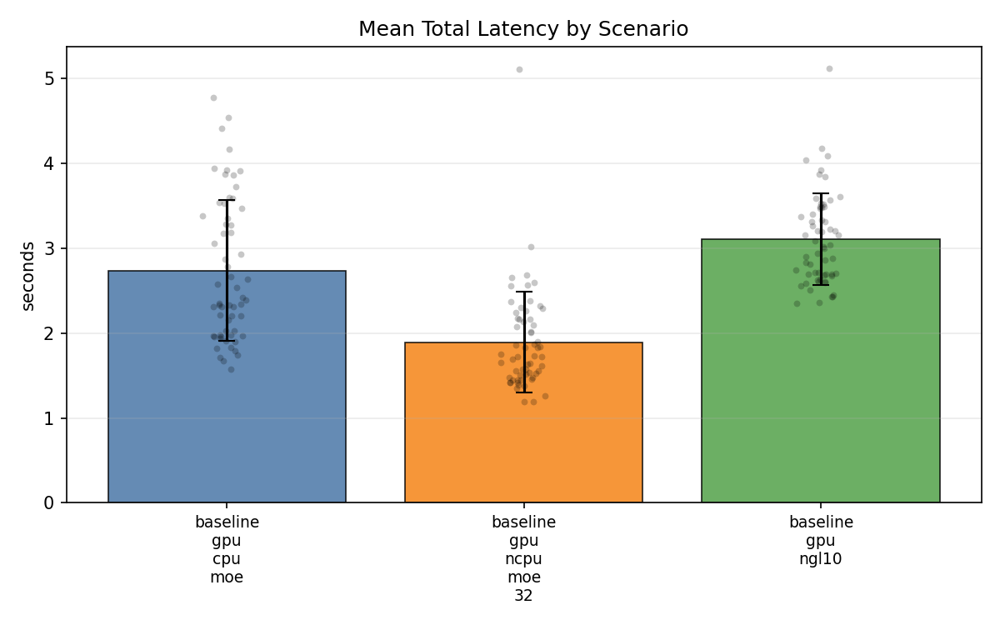

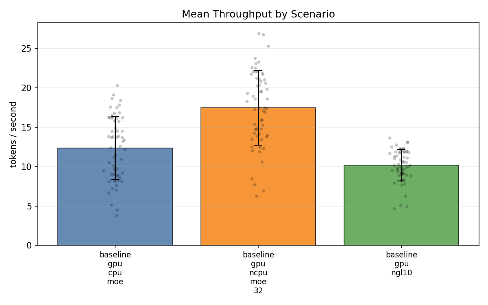

### Partial MoE Offload

最佳 baseline 是 `--n-cpu-moe 32`：

| scenario | mean TTFT (s) | mean total (s) | tok/s | major faults |
|---|---:|---:|---:|---:|
| baseline-gpu-cpu-moe | 1.356 | 2.736 | 12.383 | 16,373 |
| baseline-gpu-ncpu-moe-32 | 0.882 | 1.892 | 17.464 | 8,952 |

`baseline-gpu-ncpu-moe-32` 相對 `--cpu-moe`：

| 指標 | 改善幅度 |
|---|---:|
| total latency | 降低 30.85% |
| TTFT | 降低 34.96% |
| tok/s | 提升 41.03% |
| major faults | 降低 45.32% |

這組是目前整體推論表現最佳的 baseline。

## RPP Page-cache Prefetch

first-token RPP prefetch 會先生成第一個 token，再用 prompt + first token 跑 RPP，預測 continuation experts。

GPU 對照：

| scenario | total (s) | first token (s) | continuation (s) | RPP ms | prefetch ms | prefetch MB | major faults |
|---|---:|---:|---:|---:|---:|---:|---:|
| rpp-first-token-gpu | 5.828 | 2.994 | 1.752 | 147.4 | 148.4 | 487 | 105,538 |
| two-step-no-rpp-gpu | 4.991 | 3.060 | 1.931 | 0.0 | 0.0 | 0 | 122,608 |

RPP GPU 的 first token 與 continuation 有些微改善，major faults 也下降。但因為 RPP 與 prefetch 有額外同步成本，總 latency 反而變差。

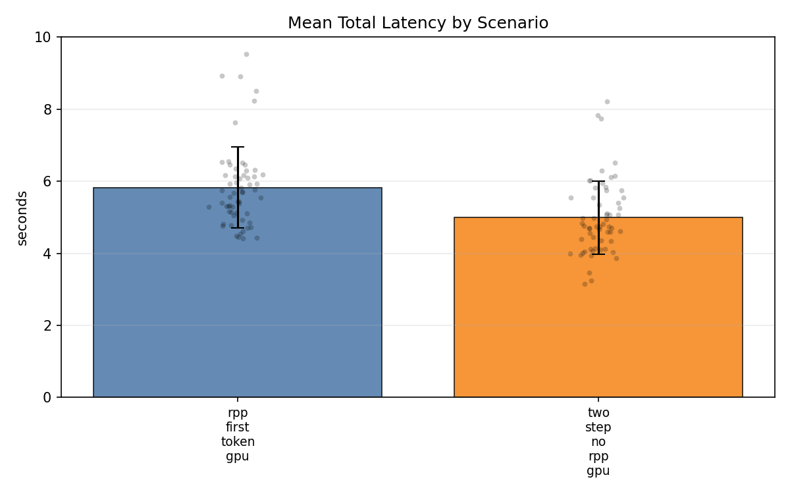

### Top-K Sweep

| scenario | total (s) | prefetch MB | major faults | first major | continuation major |
|---|---:|---:|---:|---:|---:|
| top-k 2 | 5.933 | 122 | 88,135 | 62,401 | 25,735 |
| top-k 4 | 6.029 | 243 | 73,776 | 49,982 | 23,794 |
| top-k 8 | 5.828 | 487 | 105,538 | 88,850 | 16,688 |
| no-RPP | 4.991 | 0 | 122,608 | 99,600 | 23,009 |

top-k 4 的 major faults 最低，但 latency 不是最好；top-k 8 的 continuation faults 最低，但 prefetch MB 最大。這表示 top-k 不是越大越好。

## RPP-GPU Trace

RPP-GPU trace 先驗證 `--cpu-moe` 下 selected expert matmul 能不能放到 GPU。

| scenario | offload min batch | total (s) | TTFT (s) | tok/s | major faults | H2D events | H2D payload |
|---|---:|---:|---:|---:|---:|---:|---:|
| gpu-cpu-moe-phase1 | 32 | 5.100 | 2.651 | 6.275 | 144,317 | 0 | 0 MB |
| gpu-cpu-moe-expert-gpu-offload | 1 | 6.478 | 2.708 | 4.940 | 8,116 | 4,077 | 25,581.7 MB |

當 offload threshold = 1 時，MoE expert matmul 幾乎都能 offload 到 CUDA，但每個 request 會產生約 25.6GB selected-expert H2D payload。這證明只做 selected-expert GPU offload 不夠，必須加入持久化 GPU expert cache。

## Offline Oracle and Real-RPP

### 100% Oracle Upper Bound

Oracle 使用真實 router selected experts 當作 100% 準確 prediction，模擬不同 VRAM expert cache 容量：

| cache | hit rate | H2D miss GB | saved GB | reduction | per request miss GB |
|---:|---:|---:|---:|---:|---:|
| baseline | 0.0% | 1572.8 | 0.0 | 0.0% | 26.21 |
| 1GB | 30.5% | 1093.7 | 479.2 | 30.5% | 18.23 |
| 2GB | 43.8% | 884.1 | 688.7 | 43.8% | 14.73 |
| 4GB | 63.3% | 577.7 | 995.1 | 63.3% | 9.63 |
| 6GB | 75.5% | 385.8 | 1187.0 | 75.5% | 6.43 |

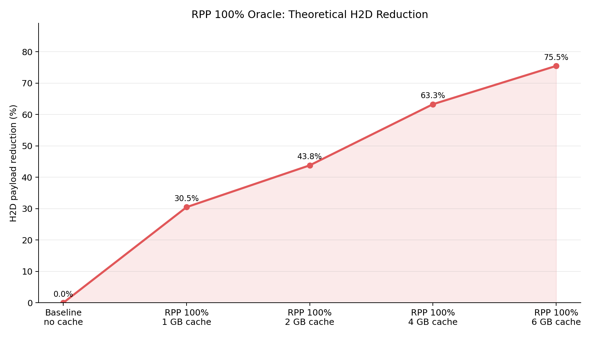

結論：如果 prediction 完美且 cache 夠大，GPU expert cache 的理論空間很大。

### Offline Real-RPP

把 oracle 換成真實 RPP d64 checkpoint 後，4GB cache 下：

| 方法 | hit rate | H2D miss GB | reduction | pred recall(payload) | false positive GB |
|---|---:|---:|---:|---:|---:|
| demand-only cache | 68.9% | 342.4 | 68.9% | 0.0% | 0.0 |
| real RPP top-k 2 | 69.4% | 336.5 | 69.4% | 4.1% | 2.8 |
| real RPP top-k 4 | 70.0% | 330.4 | 70.0% | 7.5% | 5.3 |
| real RPP top-k 8 | 71.0% | 319.2 | 71.0% | 13.2% | 11.1 |

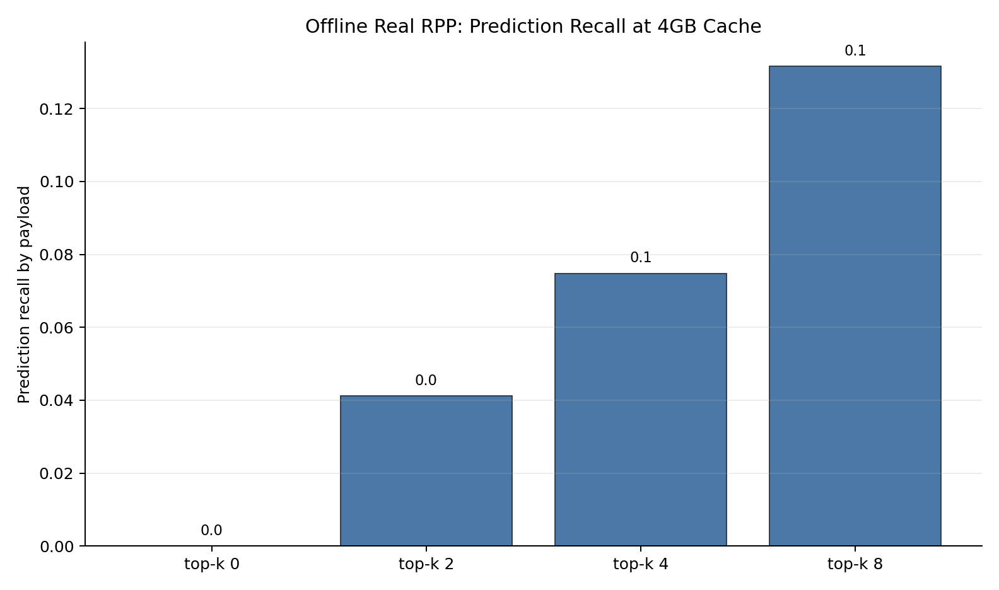

Real-RPP 有額外幫助，但遠小於 oracle。top-k 8 對 continuation payload 的 recall 只有約 13.2%，代表接進 runtime 後不能期待直接大幅加速。

## Runtime GPU Expert Cache

### Demand-only Cache

先不使用 RPP，只做 demand-only GPU expert cache：

```text
router selected experts
-> cache hit: GPU cache slot -> D2D staging
-> cache miss: CPU mmap -> H2D -> GPU cache slot -> D2D staging
-> GPU MoE matmul
```

Phase 4 formal sweep：

| cache | requests | total s | TTFT s | tok/s | demand MB/request | actual H2D MB/request | H2D reduction | cache hit | D2D MB/request |
|---:|---:|---:|---:|---:|---:|---:|---:|---:|---:|
| 0MB | 60 | 7.753 | 3.856 | 4.026 | 26213.6 | 26213.6 | 0.0% | 0.0% | 0.0 |
| 2GB | 60 | 7.308 | 3.929 | 4.316 | 26213.6 | 16415.0 | 37.4% | 37.2% | 26234.6 |
| 4GB | 60 | 7.014 | 3.958 | 4.517 | 26213.6 | 12739.4 | 51.4% | 51.2% | 26234.6 |

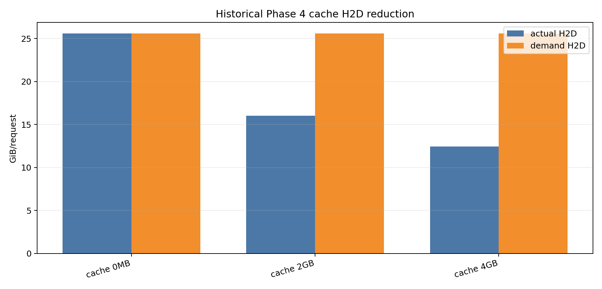

Demand-only cache 能有效降低 H2D payload，4GB cache 約少 51.4%。但 latency 改善小於 H2D reduction，因為目前 hit 時仍需要 D2D staging，且 H2D miss 尚未與 GPU compute overlap。

### Runtime RPP Hint Smoke

Phase 5 先用 hint file 將 RPP prediction 接進 C++ runtime cache path：

```text
first-token request
-> Python RPP predicts experts
-> write hint file
-> continuation request reads hints
-> hinted experts admitted to GPU cache
```

單筆 smoke test 結果：

| variant | demand-only s | RPP hint s | latency delta | demand H2D MB | RPP total H2D MB | total H2D delta |
|---|---:|---:|---:|---:|---:|---:|
| FTO top-8/admit-1 | 5.684 | 5.575 | -0.109 | 9880.2 | 9975.4 | +95.2 |
| FTO top-8/admit-2 | 5.745 | 6.065 | +0.321 | 9880.2 | 10099.6 | +219.3 |
| Rank top-2 | 5.852 | 5.377 | -0.474 | 9880.2 | 10228.6 | +348.4 |
| Rank top-4 | 5.321 | 6.225 | +0.904 | 9880.2 | 10753.9 | +873.7 |
| Rank top-8 | 5.417 | 6.030 | +0.613 | 9880.2 | 11678.2 | +1798.0 |

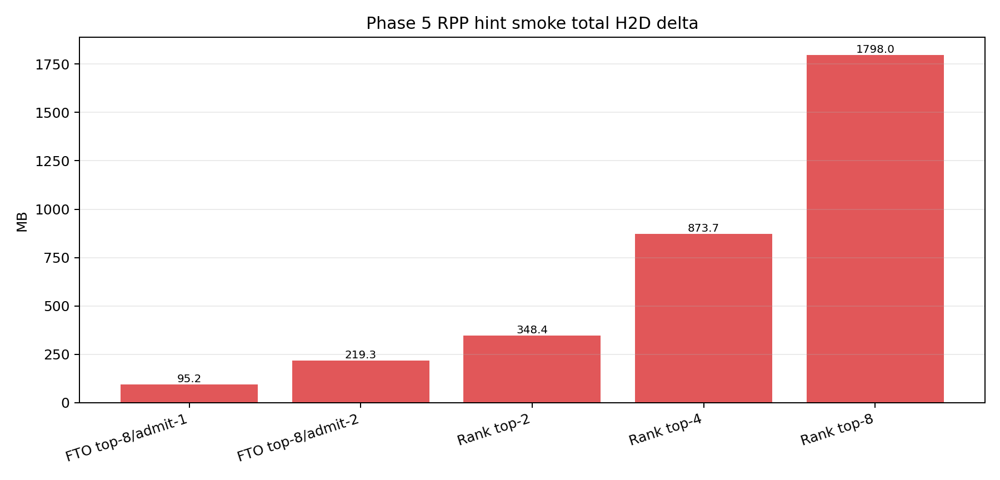

Naive rank top-k 會增加 total H2D；FTO top-8/admit-1 最接近可用，但仍未正式勝過 demand-only。

## Online RPP-GPU Formal

最後把 `rpp_runtime_implementation` 接到 Qwen3.6，使用 persistent online RPP sidecar 做 formal sweep。

設定：

```text
20 prompts x repeat 3 = 60 requests / scenario
n_predict = 32
ctx_size = 512
--ngl 999
--cpu-moe
GPU expert cache = 1GB
RPP sidecar = CPU
```

最新 baseline rerun：

| scenario | requests | latency s | tok/s |
|---|---:|---:|---:|
| native baseline rerun | 60 | 6.023 | 11.164 |

Phase 6 formal：

| scenario | latency s | tok/s | prediction coverage | RPP hit | ready-hit | total H2D GB/request |
|---|---:|---:|---:|---:|---:|---:|
| rpp-off-native | 6.023 | 11.164 | 0.0% | 0.0% | 0.0% | 0.000 |
| demand-cache-1g | 9.734 | 4.942 | 0.0% | 0.0% | 36.7% | 11.626 |
| online-rpp-top2 | 11.027 | 4.300 | 100.0% | 8.6% | 36.6% | 16.233 |
| online-rpp-top4 | 10.768 | 4.264 | 100.0% | 16.2% | 17.2% | 24.134 |
| online-rpp-top8 | 11.558 | 3.915 | 100.0% | 27.4% | 1.2% | 31.787 |

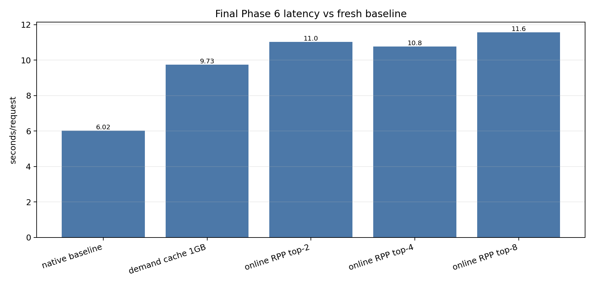

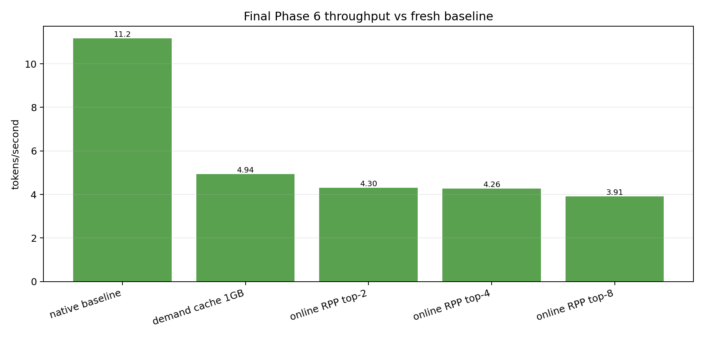

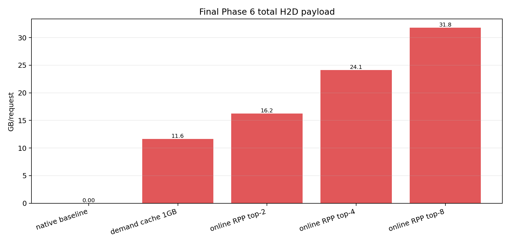

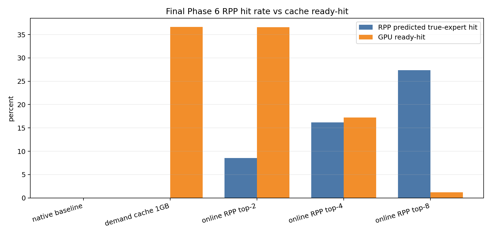

結果：

- online RPP sidecar path 功能上成功接通，top2/top4/top8 的 prediction coverage 都是 100%。
- 但沒有任何 online RPP scenario 勝過重新量測的 native baseline。
- top-k 越大，RPP hit rate 越高，但 total H2D 和 cache churn 也越大。
- sidecar inference 平均只有約 4-5ms，因此瓶頸不是 RPP model forward，而是 prefetch admission、H2D 搬移、cache eviction 與 ready-hit 不足。

## 分析

### 為什麼 RPP 沒有變快？

目前 RPP 沒有勝過 baseline，主要不是因為 RPP 完全預測不到，而是系統層面的收益沒有超過成本：

1. RPP first-token 對 continuation 的 payload recall 有限。
2. 未篩選的 top-k 會帶來 false positives，把不會用到的 experts 搬進 cache。
3. 1GB cache 太小，top-k 越大越容易造成 eviction。
4. 目前 prefetch / admission 仍不夠精準，沒有對齊 ubatch execution order。
5. H2D copy 還沒有真正和 GPU compute 充分 overlap。
6. cache hit 仍需要 D2D staging，還不是 direct-read cache。

### 目前真正有價值的是什麼？

目前最有價值的部分不是未篩選的 online RPP，而是：

1. selected-expert GPU offload path 已被確認。
2. GPU expert cache 可以在 component level 降低重複 H2D。
3. RPP hints / online sidecar 已經能進入 runtime。
4. FTO admission 比未篩選的 rank top-k 更有希望。

換句話說，系統路徑已經打通，但 admission policy 和 overlap 還不夠好。

## 結論

1. Qwen3.6 35B MoE 在本機 14GiB RAM / 8GiB VRAM 下，CPU-only 推論嚴重 IO-bound。
2. GPU partial offload 是目前最有效 baseline，`baseline-gpu-ncpu-moe-32` 達到約 1.892s/request。
3. RPP d64 predictor 有可用 routing recall，test token_recall@8 約 0.714。
4. CPU-side RPP page-cache prefetch 可以降低部分 faults，但同步 prefetch 成本讓 end-to-end latency 沒有改善。
5. Offline oracle 顯示 GPU expert cache 有很大理論空間；real-RPP 顯示實際 prediction gain 遠小於 oracle。
6. Runtime demand-only GPU expert cache 能降低 H2D payload，4GB cache 約降 51.4%，但仍受 D2D staging 與缺乏 overlap 限制。
7. Runtime RPP hint 與 online RPP sidecar 都已功能接通。
8. 最新 Phase 6 formal 顯示，online RPP top2/top4/top8 都沒有勝過重新量測的 native baseline。
9. 下一步不應繼續單純加大 top-k，而應轉向 batch-aware / ubatch-aware admission、FTO、async prefetch 和 direct-read cache。

## 後續工作

建議下一步依序做：

1. 停止單純擴大 top-k。
2. 對 FTO top-8/admit-1 做 repeat，確認單筆 smoke test 中觀察到的趨勢是否穩定。
3. 建立 batch-aware runner，測 concurrency 1 / 2 / 4。
4. 將 RPP admission 改成 ubatch-aware，只 admission 即將使用的 layer/expert。
5. 加入 confidence threshold、frequency threshold、time-to-use estimate。
6. 將 admission 移到 background async prefetch worker，嘗試 H2D 與 GPU compute overlap。
7. 加 CUDA event，區分 enqueue time、實際 H2D time、D2D staging time。
8. 規劃 direct-read cache，讓 MoE matmul 直接讀持久化 cache slot。

## HackMD 圖片處理

本文圖片目前使用 repo 相對路徑。若貼到 HackMD 後圖片沒有顯示，請將以下 PNG 拖曳上傳到 HackMD，再替換對應連結：

| 圖 | 路徑 |
|---|---|
| GPU baseline latency | `figures/gpu_all_baseline_total_latency.png` |
| GPU baseline throughput | `figures/gpu_all_baseline_throughput.png` |
| RPP vs no-RPP latency | `figures/phase2_gpu_rpp_vs_no_rpp_total_latency.png` |
| Oracle H2D reduction | `figures/oracle_vs_baseline_h2d_reduction.png` |
| Real RPP recall | `figures/real_rpp_prediction_recall_4gb.png` |
| Runtime cache H2D | `figures/final_phase4_cache_h2d_reduction.png` |
| Phase 5 H2D delta | `figures/final_phase5_hint_h2d_delta.png` |
| Phase 6 latency | `figures/final_phase6_latency_vs_baseline.png` |
| Phase 6 throughput | `figures/final_phase6_throughput_vs_baseline.png` |
| Phase 6 H2D | `figures/final_phase6_total_h2d_vs_baseline.png` |
| Phase 6 hit rate | `figures/final_phase6_hit_rate_vs_ready_hit.png` |

## 主要資料來源

| 類別 | 路徑 |
|---|---|
| 完整報告 | `report.md` |
| RPP-GPU README | `README.md` |
| RPP d64 training report | `results/rpp_train_d64/REPORT.md` |
| CPU/GPU baseline results | `results/rpp_analyze/` |
| Oracle comparison | `results/oracle_hints/oracle_vs_baseline_comparison.md` |
| Offline real-RPP | `results/real_rpp_offline/real_rpp_first_token_offline_formal_0625_2251.summary.md` |
| Runtime cache formal | `results/phase4_runtime_cache_formal_comparison.md` |
| Runtime RPP hint smoke | `results/phase5_runtime_rpp_hint_smoke_comparison.md` |
| Online RPP-GPU formal | `results/phase6_qwen_online_rpp_gpu_formal_0626_1441.summary.md` |
| Final comparison | `results/final_runtime_comparison_0626.md` |
